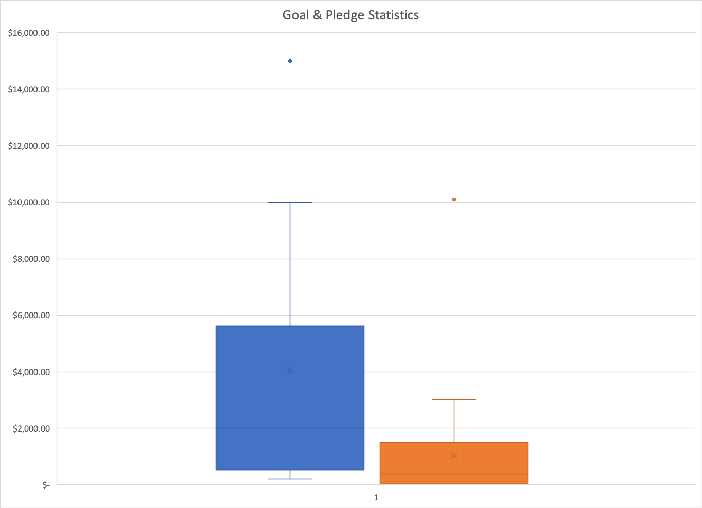

# An Analysis of Kickstarter Campaigns.

> Louise plans to start a Kickstarter campaign to fun her new play "Fever" with an estimated cost of 10k. We will review other Kickstarter campaigns to help Louise gain an understanding of what might make a her project more successful as well as uncover any changes she might need to make.

## Data Analysis
By filtering the data by the parent categories we can see that theatre and musicals are very popular and both are more likely to be successfully funded.
![parentCategory_outcomes.png]

Digging deeper into the subcategories we can see that the subcateory: plays are again popular on Kickstarter and also more likely to succeed.
![subcategory_statistics.png]

This chart on campaign data based on launch dates shows that May and June have higher success rates than other months.
![outcome_launchDate.png]

And finally according to this chart of goals and pledges for musicals in Great Britain we can see that the average pledged amount for a successful campaign was $1,047

The average $1,047 successful 

## Recommendations
Based on the statistics portrayed we recommend Louise launch her campaign in May. Also, because the successful average for a musical was $1,047 we recommend trying to reduce her $10,000 budget.
